# Sacco Management System - Actual Use Case Diagram

```mermaid
erDiagram
    %% Actors
    ADMIN ||--o{ MANAGE_USERS : "manages"
    ADMIN ||--o{ MANAGE_FLEET : "manages"
    ADMIN ||--o{ MANAGE_ROUTES : "manages"
    ADMIN ||--o{ ASSIGN_ROUTES : "assigns"
    ADMIN ||--o{ ASSIGN_VEHICLES : "assigns"
    ADMIN ||--o{ MANAGE_PERFORMANCE : "manages"
    ADMIN ||--o{ GENERATE_REPORTS : "generates"
    ADMIN ||--o{ MANAGE_SACCO_MEMBERS : "manages"
    
    EMPLOYEE ||--o{ UPDATE_VEHICLE_STATUS : "updates"
    EMPLOYEE ||--o{ VIEW_BOOKING_STATUS : "views"
    EMPLOYEE ||--o{ MANAGE_DRIVER_LOG : "manages"
    EMPLOYEE ||--o{ TRACK_PERFORMANCE : "tracks"
    EMPLOYEE ||--o{ VIEW_PAYMENT_SUMMARY : "views"
    EMPLOYEE ||--o{ MANAGE_VEHICLE_HEALTH : "manages"
    EMPLOYEE ||--o{ VIEW_ASSIGNED_ROUTES : "views"
    
    PASSENGER ||--o{ REGISTER_LOGIN : "performs"
    PASSENGER ||--o{ BOOK_MATATU : "books"
    PASSENGER ||--o{ VIEW_BOOKING_STATUS : "views"
    PASSENGER ||--o{ VIEW_DASHBOARD : "views"
    
    %% Use Cases
    REGISTER_LOGIN {
        string register_account
        string login_to_system
    }
    
    BOOK_MATATU {
        string select_route
        string enter_booking_details
        string confirm_booking
    }
    
    VIEW_BOOKING_STATUS {
        string view_personal_bookings
        string check_booking_details
    }
    
    VIEW_DASHBOARD {
        string view_statistics
        string view_recent_bookings
    }
    
    MANAGE_FLEET {
        string add_vehicle
        string update_vehicle
        string remove_vehicle
        string view_vehicles
    }
    
    MANAGE_ROUTES {
        string create_route
        string edit_route
        string view_routes
    }
    
    ASSIGN_ROUTES {
        string assign_driver_to_route
        string update_route_assignments
        string view_assignments
    }
    
    ASSIGN_VEHICLES {
        string assign_vehicle_to_route
        string update_vehicle_assignments
        string view_vehicle_assignments
    }
    
    UPDATE_VEHICLE_STATUS {
        string update_availability
        string update_condition
    }
    
    MANAGE_DRIVER_LOG {
        string submit_daily_log
        string view_logs
        string export_logs
    }
    
    MANAGE_VEHICLE_HEALTH {
        string submit_health_check
        string view_health_history
    }
    
    VIEW_ASSIGNED_ROUTES {
        string view_current_assignments
        string export_assignments
    }
    
    TRACK_PERFORMANCE {
        string view_performance_metrics
        string export_performance_data
    }
    
    VIEW_PAYMENT_SUMMARY {
        string view_earnings
        string export_payment_data
    }
    
    MANAGE_PERFORMANCE {
        string add_performance_record
        string edit_performance_record
        string delete_performance_record
        string view_performance_data
        string export_performance_data
    }
    
    MANAGE_USERS {
        string add_user
        string edit_user
        string view_users
    }
    
    MANAGE_SACCO_MEMBERS {
        string add_member
        string edit_member
        string view_members
    }
    
    GENERATE_REPORTS {
        string view_system_usage
        string view_booking_trends
        string view_fleet_performance
        string view_financial_reports
    }
```




```mermaid
graph TD
    A[User Roles] --> B(Admin)
    A --> C(Employee)
    A --> D(Passenger)
    
    B --> E[User Management]
    B --> F[Fleet Management]
    B --> G[Route Management]
    B --> H[Assignments]
    B --> I[Performance Management]
    B --> J[Reports]
    B --> K[SACCO Members]
    
    C --> L[Vehicle Status Updates]
    C --> M[Booking Status View]
    C --> N[Driver Logs]
    C --> O[Performance Tracking]
    C --> P[Payment Summary]
    C --> Q[Vehicle Health]
    C --> R[Assigned Routes]
    
    D --> S[Registration/Login]
    D --> T[Booking]
    D --> U[Booking Status]
    D --> V[Dashboard]