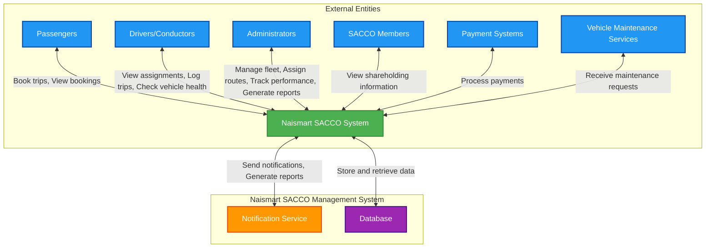

# Naismart SACCO Management System - Context Diagram

## Overview

The Naismart SACCO Management System is a comprehensive web-based platform designed to streamline the operations of transportation Savings and Credit Cooperative Organizations (SACCOs). The system provides tools for fleet management, route planning, staff management, booking services, performance tracking, and financial reporting.

## Context Diagram

## System Components

### Core System (Naismart SACCO Management System)
The central system that handles all business logic, user management, data processing, and coordination between different modules.

### Database
Stores all system data including:
- User information (administrators, employees, passengers)
- Vehicle information and fleet management data
- Route definitions and assignments
- Booking records
- Performance metrics
- Financial data (payments, commissions)
- Vehicle health checks and maintenance records

### Notification Service
Handles system notifications and alerts to users for various events such as:
- Booking confirmations
- Assignment updates
- Payment notifications
- Maintenance reminders

## External Entities and Their Interactions

### 1. Passengers
- **Primary Function**: Book trips and view booking history
- **Interactions**:
  - Create new trip bookings with route, pickup, and dropoff locations
  - View booking status and history
  - Receive booking confirmations and updates

### 2. Drivers/Conductors (Employees)
- **Primary Function**: Operate vehicles and report on daily activities
- **Interactions**:
  - View assigned routes and schedules
  - Log daily trip information (mileage, earnings, passengers served)
  - Perform vehicle health checks
  - View performance metrics and payment summaries

### 3. Administrators
- **Primary Function**: Manage the entire system and oversee operations
- **Interactions**:
  - Manage fleet (add/edit vehicles)
  - Create and manage routes
  - Assign drivers to routes
  - Assign vehicles to routes
  - Track employee performance
  - Manage staff information
  - Generate reports on various aspects of the business
  - Manage SACCO membership information

### 4. SACCO Members
- **Primary Function**: View shareholding and membership information
- **Interactions**:
  - View shareholding details
  - Update personal information

### 5. Payment Systems
- **Primary Function**: Process financial transactions
- **Interactions**:
  - Process employee payments based on performance
  - Handle passenger payments for bookings

### 6. Vehicle Maintenance Services
- **Primary Function**: Perform vehicle maintenance
- **Interactions**:
  - Receive maintenance requests based on vehicle health checks
  - Update maintenance completion status

## Key System Features

### User Management
- Multi-role user system (Admin, Employee, Passenger)
- Secure authentication with password hashing
- User registration and profile management

### Fleet Management
- Vehicle registration and tracking
- Vehicle status monitoring
- Route assignment for vehicles

### Route Management
- Create and manage transportation routes
- Define origins, destinations, and stops
- Track route status and performance

### Booking System
- Passenger trip booking
- Route selection
- Pickup and dropoff location specification
- Booking status tracking

### Performance Tracking
- Employee performance metrics
- Trip counting and monitoring
- Fare collection tracking
- Commission calculation

### Financial Management
- Employee payment processing
- Commission calculation
- Fare collection records
- Financial reporting and export capabilities

### Vehicle Health Monitoring
- Daily vehicle condition assessments
- Maintenance requirement tracking
- Vehicle condition reporting

## Technology Stack

- **Backend**: Python Flask
- **Database**: MySQL (Production), SQLite (Testing)
- **ORM**: SQLAlchemy
- **Authentication**: Flask-Login
- **Frontend**: HTML, CSS, JavaScript
- **Migration**: Flask-Migrate

## Data Flow

1. **User Authentication**: All external entities must authenticate before accessing system features
2. **Data Entry**: Users input data through web forms which is validated and stored in the database
3. **Data Processing**: System processes data to generate reports, calculate payments, and update statuses
4. **Notifications**: System sends notifications to relevant parties based on events
5. **Reporting**: Administrators can generate various reports for business insights
6. **Data Retrieval**: Users can retrieve their relevant data through dashboards and reports

This context diagram provides a high-level overview of the Naismart SACCO Management System and its interactions with external entities. It shows the system boundaries and major data flows, which helps in understanding the overall architecture and scope of the system.