# NaiSmart SACCO Management System - Improved DFD Level 1

## Data Flow Diagram (Level 1)

```mermaid
graph TD
    %% External Entities (Yellow)
    A[Passengers]:::external
    B[Drivers/Conductors]:::external
    C[Administrators]:::external
    D[SACCO Members]:::external
    E[Payment Systems]:::external
    F[Vehicle Maintenance Services]:::external
    
    %% Core Processes (Rounded Purple)
    P1[1.0 Register/Login]:::process
    P2[2.0 Book Trip]:::process
    P3[3.0 Manage Fleet]:::process
    P4[4.0 Create Routes]:::process
    P5[5.0 Assign Fleet]:::process
    P6[6.0 Generate Reports]:::process
    P7[7.0 Track Performance]:::process
    P8[8.0 Log Driver Activities]:::process
    P9[9.0 Monitor Vehicle Health]:::process
    P10[10.0 Manage Payments]:::process
    P11[11.0 Manage SACCO Members]:::process
    
    %% Data Stores (Blue)
    DB1[User DB]:::datastore
    DB2[Booking DB]:::datastore
    DB3[Vehicle DB]:::datastore
    DB4[Route DB]:::datastore
    DB5[SACCO Member DB]:::datastore
    DB6[Assignment DB]:::datastore
    DB7[Payment DB]:::datastore
    DB8[Performance DB]:::datastore
    DB9[Driver Log DB]:::datastore
    DB10[Vehicle Health DB]:::datastore
    
    %% Data Flows
    %% Passengers
    A <-- "1. Register/Login requests" --> P1
    A <-- "2. Trip booking requests" --> P2
    A <-- "3. View booking history" --> DB2
    P1 <-- "4. Authentication data" --> DB1
    P2 <-- "5. Booking records" --> DB2
    DB2 -- "6. Booking confirmations" --> A
    
    %% Drivers/Conductors
    B <-- "7. View assignments" --> P5
    B <-- "8. Log daily activities" --> P8
    B <-- "9. Check vehicle health" --> P9
    B <-- "10. View performance" --> P7
    B <-- "11. View payments" --> P10
    P8 --> DB9
    P9 --> DB10
    P7 --> DB8
    P10 --> DB7
    
    %% Administrators
    C <-- "12. Manage fleet" --> P3
    C <-- "13. Create routes" --> P4
    C <-- "14. Assign vehicles" --> P5
    C <-- "15. Track performance" --> P7
    C <-- "16. Generate reports" --> P6
    C <-- "17. Manage payments" --> P10
    C <-- "18. Manage SACCO members" --> P11
    P3 --> DB3
    P4 --> DB4
    P5 --> DB6
    P6 --> DB1 & DB2 & DB3 & DB4 & DB5 & DB6 & DB7 & DB8 & DB9 & DB10
    P11 --> DB5
    
    %% SACCO Members
    D <-- "19. View shareholding info" --> P11
    P11 <-- "20. Membership data" --> DB5
    DB5 -- "21. Shareholding details" --> D
    
    %% Payment Systems
    E <-- "22. Process payments" --> P10
    P10 <-- "23. Payment records" --> DB7
    DB7 -- "24. Payment confirmations" --> E
    
    %% Vehicle Maintenance Services
    F <-- "25. Receive maintenance requests" --> P9
    P9 <-- "26. Vehicle health data" --> DB10
    DB10 -- "27. Maintenance requests" --> F
    
    %% Styling
    classDef external fill:#FFEB3B,stroke:#000,color:#000;
    classDef process fill:#9C27B0,stroke:#000,color:#fff,rx:20px,ry:20px;
    classDef datastore fill:#2196F3,stroke:#000,color:#fff;
    
    class A,B,C,D,E,F external
    class P1,P2,P3,P4,P5,P6,P7,P8,P9,P10,P11 process
    class DB1,DB2,DB3,DB4,DB5,DB6,DB7,DB8,DB9,DB10 datastore
```

## Diagram Layout Explanation

This improved DFD follows the requested layout:

1. **Core processes** are stacked vertically in the center (P1-P11)
2. **External actors** are positioned on the left and right sides
3. **Data stores** are aligned horizontally below the processes
4. **Visual styling** follows the specified color scheme:
   - Yellow rectangles for external entities
   - Rounded purple boxes for processes
   - Blue rectangles for data stores
5. **Clean arrows** with proper spacing and readable direction

The diagram now accurately represents the complete NaiSmart SACCO Management System with all identified entities, processes, and data stores.