# Naismart SACCO Management System - Entity Relationship Diagram

## Enhanced ERD with Crow's Foot Notation

```mermaid
erDiagram
    USER {
        int id PK "Primary Key"
        string username UK "Unique"
        string email UK "Unique"
        string password_hash
        string role "admin/employee/passenger"
        string full_name
        string status "active/inactive"
    }
    
    SACCO_MEMBER {
        int id PK "Primary Key"
        string full_name
        string id_number UK "Unique"
        string email UK "Unique"
        string phone
        float shareholding
    }
    
    VEHICLE {
        int id PK "Primary Key"
        string plate_number UK "Unique"
        string vehicle_model
        string assigned_route
        string status "active/inactive/maintenance"
        datetime created_at
        datetime updated_at
    }
    
    FLEET {
        int id PK "Primary Key"
        string plate_number UK "Unique"
        string vehicle_model
        string assigned_route
        string status "active/inactive"
    }
    
    ROUTE {
        int id PK "Primary Key"
        string route_name
        string origin
        string destination
        string stops
        string status "active/inactive"
    }
    
    ASSIGNED_ROUTE {
        int id PK "Primary Key"
        int employee_id FK "References USER.id"
        int route_id FK "References ROUTE.id"
        int vehicle_id FK "References VEHICLE.id"
        datetime date_assigned
        date start_date
        date end_date
        string status "active/completed/cancelled"
        string shift "morning/afternoon/evening"
        text notes
        int created_by FK "References USER.id"
        datetime created_at
        datetime updated_at
    }
    
    VEHICLE_ROUTE_ASSIGNMENT {
        int id PK "Primary Key"
        int vehicle_id FK "References VEHICLE.id"
        int route_id FK "References ROUTE.id"
        datetime assigned_date
        date start_date
        date end_date
        string status "active/completed/cancelled"
        string priority "high/normal/low"
        text notes
        int assigned_by FK "References USER.id"
        datetime created_at
        datetime updated_at
    }
    
    BOOKING {
        int id PK "Primary Key"
        string route
        string pickup
        string dropoff
        string date "String format - needs conversion"
        string time "String format"
        string name
        string contact
        string status "pending/confirmed/cancelled"
    }
    
    EMPLOYEE_PAYMENT {
        int id PK "Primary Key"
        int employee_id FK "References USER.id"
        int total_trips
        float total_fare_collected
        float commission_earned
        string payment_status "pending/paid/cancelled"
        date payment_date
    }
    
    PERFORMANCE {
        int id PK "Primary Key"
        int employee_id FK "References USER.id"
        date date
        int trips
        float fare_collected
        float commission
        string route
    }
    
    DRIVER_LOG {
        int id PK "Primary Key"
        int driver_id FK "References USER.id"
        int vehicle_id FK "References VEHICLE.id"
        int route_id FK "References ROUTE.id"
        date log_date
        float starting_mileage
        float ending_mileage
        float total_distance
        float total_earnings
        float fuel_cost
        float maintenance_cost
        float net_earnings
        int trips_completed
        int passengers_served
        text notes
        datetime created_at
        datetime updated_at
    }
    
    VEHICLE_HEALTH {
        int id PK "Primary Key"
        int vehicle_id FK "References VEHICLE.id"
        int driver_id FK "References USER.id"
        datetime check_date
        int engine_condition "Scale 1-5"
        int brake_condition "Scale 1-5"
        int tire_condition "Scale 1-5"
        int lights_condition "Scale 1-5"
        int body_condition "Scale 1-5"
        int fuel_level "Scale 1-5"
        int oil_level "Scale 1-5"
        int coolant_level "Scale 1-5"
        text issues_noted
        boolean maintenance_needed
    }

    %% Relationships with Crow's Foot Notation
    
    %% USER relationships (One-to-Many)
    USER ||--o{ ASSIGNED_ROUTE : "employee_id (One User can have Many Route Assignments)"
    USER ||--o{ ASSIGNED_ROUTE : "created_by (One Admin creates Many Assignments)"
    USER ||--o{ VEHICLE_ROUTE_ASSIGNMENT : "assigned_by (One Admin creates Many Vehicle Assignments)"
    USER ||--o{ EMPLOYEE_PAYMENT : "employee_id (One Employee has Many Payments)"
    USER ||--o{ PERFORMANCE : "employee_id (One Employee has Many Performance Records)"
    USER ||--o{ DRIVER_LOG : "driver_id (One Driver has Many Log Entries)"
    USER ||--o{ VEHICLE_HEALTH : "driver_id (One Driver performs Many Health Checks)"
    
    %% ROUTE relationships (One-to-Many)
    ROUTE ||--o{ ASSIGNED_ROUTE : "route_id (One Route can be assigned to Many Employees)"
    ROUTE ||--o{ VEHICLE_ROUTE_ASSIGNMENT : "route_id (One Route can have Many Vehicle Assignments)"
    ROUTE ||--o{ DRIVER_LOG : "route_id (One Route has Many Driver Log Entries)"
    
    %% VEHICLE relationships (One-to-Many)
    VEHICLE ||--o{ ASSIGNED_ROUTE : "vehicle_id (One Vehicle can be in Many Route Assignments)"
    VEHICLE ||--o{ VEHICLE_ROUTE_ASSIGNMENT : "vehicle_id (One Vehicle can have Many Direct Route Assignments)"
    VEHICLE ||--o{ DRIVER_LOG : "vehicle_id (One Vehicle has Many Driver Log Entries)"
    VEHICLE ||--o{ VEHICLE_HEALTH : "vehicle_id (One Vehicle has Many Health Check Records)"
```

## Detailed Relationship Analysis

### Primary Relationships with Cardinality:

#### 1. **USER Entity Relationships**
- **USER (1) ↔ ASSIGNED_ROUTE (Many)** via `employee_id`
  - One employee can be assigned to multiple routes over time
  - Cardinality: 1:N

- **USER (1) ↔ ASSIGNED_ROUTE (Many)** via `created_by`
  - One admin can create multiple route assignments
  - Cardinality: 1:N

- **USER (1) ↔ EMPLOYEE_PAYMENT (Many)** via `employee_id`
  - One employee can have multiple payment records
  - Cardinality: 1:N

- **USER (1) ↔ PERFORMANCE (Many)** via `employee_id`
  - One employee can have multiple performance records
  - Cardinality: 1:N

- **USER (1) ↔ DRIVER_LOG (Many)** via `driver_id`
  - One driver can have multiple daily log entries
  - Cardinality: 1:N

- **USER (1) ↔ VEHICLE_HEALTH (Many)** via `driver_id`
  - One driver can perform multiple vehicle health checks
  - Cardinality: 1:N

#### 2. **ROUTE Entity Relationships**
- **ROUTE (1) ↔ ASSIGNED_ROUTE (Many)** via `route_id`
  - One route can be assigned to multiple employees
  - Cardinality: 1:N

- **ROUTE (1) ↔ VEHICLE_ROUTE_ASSIGNMENT (Many)** via `route_id`
  - One route can have multiple vehicles assigned directly
  - Cardinality: 1:N

- **ROUTE (1) ↔ DRIVER_LOG (Many)** via `route_id`
  - One route can have multiple driver log entries
  - Cardinality: 1:N

#### 3. **VEHICLE Entity Relationships**
- **VEHICLE (1) ↔ ASSIGNED_ROUTE (Many)** via `vehicle_id`
  - One vehicle can be assigned to multiple routes (through employees)
  - Cardinality: 1:N

- **VEHICLE (1) ↔ VEHICLE_ROUTE_ASSIGNMENT (Many)** via `vehicle_id`
  - One vehicle can have multiple direct route assignments
  - Cardinality: 1:N

- **VEHICLE (1) ↔ DRIVER_LOG (Many)** via `vehicle_id`
  - One vehicle can have multiple driver log entries
  - Cardinality: 1:N

- **VEHICLE (1) ↔ VEHICLE_HEALTH (Many)** via `vehicle_id`
  - One vehicle can have multiple health check records
  - Cardinality: 1:N

## Key Constraints and Business Rules

### Primary Key Constraints:
- All tables have auto-incrementing integer primary keys
- Primary keys ensure unique record identification

### Foreign Key Constraints:
- **employee_id** in multiple tables references **USER.id**
- **route_id** in multiple tables references **ROUTE.id**
- **vehicle_id** in multiple tables references **VEHICLE.id**
- **created_by/assigned_by** fields reference **USER.id** for audit trails

### Unique Constraints:
- **USER**: `username`, `email`
- **SACCO_MEMBER**: `id_number`, `email`
- **VEHICLE**: `plate_number`
- **FLEET**: `plate_number`

### Business Logic Constraints:
1. **Role-based Access**: USER.role determines system permissions
2. **Status Management**: Multiple entities use status fields for lifecycle management
3. **Date Integrity**: Assignment dates should be logically consistent
4. **Financial Calculations**: Commission calculations based on fare collection
5. **Vehicle Health Scoring**: 1-5 scale for condition assessments

## Schema Optimization Recommendations

### 1. **Eliminate Redundancy**
- Merge VEHICLE and FLEET tables (they serve the same purpose)
- Standardize status value enumerations across tables

### 2. **Improve Data Types**
- Convert BOOKING date/time fields from strings to proper DateTime types
- Add proper constraints for numeric ranges (health scores 1-5)

### 3. **Enhance Referential Integrity**
- Add CASCADE/RESTRICT rules for foreign key relationships
- Implement check constraints for status values

### 4. **Add Missing Relationships**
- Consider linking BOOKING to USER for passenger tracking
- Add relationship between SACCO_MEMBER and USER if applicable

### 5. **Performance Optimization**
- Add indexes on frequently queried foreign keys
- Consider composite indexes for date-range queries
- Add indexes on status fields for filtering operations