# Naismart SACCO Management System - Updated Entity Relationship Diagram

## Overview
This document provides an updated and accurate entity relationship diagram for the Naismart SACCO Management System, based on the actual implementation in the codebase.

## Entity Relationship Diagram

```mermaid
erDiagram
    %% User Management
    USER {
        int id PK "Primary Key"
        string username UK "Unique, Not Null"
        string email UK "Unique"
        string password_hash "Not Null"
        string role "Default: passenger (admin/employee/passenger)"
        string full_name "Nullable"
        string status "Default: active"
    }
    
    SACCO_MEMBER {
        int id PK "Primary Key"
        string full_name "Not Null"
        string id_number UK "Unique, Not Null"
        string email UK "Unique"
        string phone
        float shareholding
    }
    
    %% Fleet Management
    VEHICLE {
        int id PK "Primary Key"
        string plate_number UK "Unique, Not Null"
        string vehicle_model "Not Null"
        string assigned_route "Nullable"
        string status "Default: active"
        datetime created_at "Default: utcnow"
        datetime updated_at "Default: utcnow, OnUpdate: utcnow"
    }
    
    %% Route Management
    ROUTE {
        int id PK "Primary Key"
        string route_name "Not Null"
        string origin "Not Null"
        string destination "Not Null"
        string stops "Not Null"
        string status "Not Null"
    }
    
    %% Assignment Tables
    ASSIGNED_ROUTE {
        int id PK "Primary Key"
        int employee_id FK "References USER.id, Not Null"
        int route_id FK "References ROUTE.id, Not Null"
        int vehicle_id FK "References VEHICLE.id, Nullable"
        datetime date_assigned "Default: utcnow"
        date start_date "Default: utcnow.date, Not Null"
        date end_date "Nullable"
        string status "Default: active (active/completed/cancelled)"
        string shift "Nullable (morning/afternoon/evening)"
        text notes "Nullable"
        int created_by FK "References USER.id, Nullable"
        datetime created_at "Default: utcnow"
        datetime updated_at "Default: utcnow, OnUpdate: utcnow"
    }
    
    VEHICLE_ROUTE_ASSIGNMENT {
        int id PK "Primary Key"
        int vehicle_id FK "References VEHICLE.id, Not Null"
        int route_id FK "References ROUTE.id, Not Null"
        datetime assigned_date "Default: utcnow"
        date start_date "Default: utcnow.date, Not Null"
        date end_date "Nullable"
        string status "Default: active (active/completed/cancelled)"
        string priority "Default: normal (high/normal/low)"
        text notes "Nullable"
        int assigned_by FK "References USER.id, Nullable"
        datetime created_at "Default: utcnow"
        datetime updated_at "Default: utcnow, OnUpdate: utcnow"
    }
    
    %% Booking System
    BOOKING {
        int id PK "Primary Key"
        int user_id FK "References USER.id, Nullable"
        string route "Not Null"
        string pickup "Not Null"
        string dropoff "Not Null"
        date date "Not Null (Proper Date type)"
        time time "Not Null (Proper Time type)"
        string name "Not Null"
        string contact "Not Null"
        string status "Default: pending"
        datetime created_at "Default: utcnow"
    }
    
    %% Financial Management
    EMPLOYEE_PAYMENT {
        int id PK "Primary Key"
        int employee_id FK "References USER.id"
        int total_trips
        float total_fare_collected
        float commission_earned
        string payment_status
        date payment_date
    }
    
    PERFORMANCE {
        int id PK "Primary Key"
        int employee_id FK "References USER.id, Not Null"
        date date "Not Null"
        int trips "Default: 0"
        float fare_collected "Default: 0.0"
        float commission "Default: 0.0"
        string route
    }
    
    %% Operations
    DRIVER_LOG {
        int id PK "Primary Key"
        int driver_id FK "References USER.id, Not Null"
        int vehicle_id FK "References VEHICLE.id, Not Null"
        int route_id FK "References ROUTE.id, Not Null"
        date log_date "Default: utcnow.date, Not Null"
        float starting_mileage "Not Null"
        float ending_mileage "Not Null"
        float total_distance "Not Null"
        float total_earnings "Not Null"
        float fuel_cost "Nullable"
        float maintenance_cost "Nullable"
        float net_earnings "Not Null"
        int trips_completed "Default: 0, Not Null"
        int passengers_served "Nullable"
        text notes "Nullable"
        datetime created_at "Default: utcnow"
        datetime updated_at "Default: utcnow, OnUpdate: utcnow"
    }
    
    VEHICLE_HEALTH {
        int id PK "Primary Key"
        int vehicle_id FK "References VEHICLE.id, Not Null"
        int driver_id FK "References USER.id, Not Null"
        datetime check_date "Default: utcnow"
        int engine_condition "Not Null (1-5 scale)"
        int brake_condition "Not Null (1-5 scale)"
        int tire_condition "Not Null (1-5 scale)"
        int lights_condition "Not Null (1-5 scale)"
        int body_condition "Not Null (1-5 scale)"
        int fuel_level "Not Null (1-5 scale)"
        int oil_level "Not Null (1-5 scale)"
        int coolant_level "Not Null (1-5 scale)"
        text issues_noted
        boolean maintenance_needed "Default: False"
    }

    %% Relationships with Cardinality
    USER ||--o{ ASSIGNED_ROUTE : "employee_id (One User can have Many Route Assignments)"
    USER ||--o{ ASSIGNED_ROUTE : "created_by (One Admin creates Many Assignments)"
    USER ||--o{ VEHICLE_ROUTE_ASSIGNMENT : "assigned_by (One Admin creates Many Vehicle Assignments)"
    USER ||--o{ EMPLOYEE_PAYMENT : "employee_id (One Employee has Many Payments)"
    USER ||--o{ PERFORMANCE : "employee_id (One Employee has Many Performance Records)"
    USER ||--o{ DRIVER_LOG : "driver_id (One Driver has Many Log Entries)"
    USER ||--o{ VEHICLE_HEALTH : "driver_id (One Driver performs Many Health Checks)"
    USER ||--o{ BOOKING : "user_id (One User can make Many Bookings)"
    
    ROUTE ||--o{ ASSIGNED_ROUTE : "route_id (One Route can be assigned to Many Employees)"
    ROUTE ||--o{ VEHICLE_ROUTE_ASSIGNMENT : "route_id (One Route can have Many Vehicle Assignments)"
    ROUTE ||--o{ DRIVER_LOG : "route_id (One Route has Many Driver Log Entries)"
    
    VEHICLE ||--o{ ASSIGNED_ROUTE : "vehicle_id (One Vehicle can be in Many Route Assignments)"
    VEHICLE ||--o{ VEHICLE_ROUTE_ASSIGNMENT : "vehicle_id (One Vehicle can have Many Direct Route Assignments)"
    VEHICLE ||--o{ DRIVER_LOG : "vehicle_id (One Vehicle has Many Driver Log Entries)"
    VEHICLE ||--o{ VEHICLE_HEALTH : "vehicle_id (One Vehicle has Many Health Check Records)"
```

## Key Improvements from Previous Documentation

### 1. Corrected Data Types
- **BOOKING.date**: Now properly implemented as Date type instead of String
- **BOOKING.time**: Now properly implemented as Time type instead of String
- **BOOKING.user_id**: Added missing foreign key relationship to USER table

### 2. Removed Redundant Entities
- **FLEET** table has been removed from the diagram as it appears to be a legacy/duplicate of the VEHICLE table

### 3. Enhanced Relationship Details
- Added proper foreign key constraints with clear references
- Included detailed descriptions of relationship cardinality
- Added missing relationship between USER and BOOKING entities

### 4. Updated Entity Attributes
- All entity attributes now reflect the actual implementation in the model files
- Added proper nullability constraints and default values
- Included timestamp fields with their default values

## Relationship Cardinality Summary

### User Relationships:
- **USER (1) ↔ ASSIGNED_ROUTE (Many)** via `employee_id`
- **USER (1) ↔ ASSIGNED_ROUTE (Many)** via `created_by`
- **USER (1) ↔ VEHICLE_ROUTE_ASSIGNMENT (Many)** via `assigned_by`
- **USER (1) ↔ EMPLOYEE_PAYMENT (Many)** via `employee_id`
- **USER (1) ↔ PERFORMANCE (Many)** via `employee_id`
- **USER (1) ↔ DRIVER_LOG (Many)** via `driver_id`
- **USER (1) ↔ VEHICLE_HEALTH (Many)** via `driver_id`
- **USER (1) ↔ BOOKING (Many)** via `user_id`

### Route Relationships:
- **ROUTE (1) ↔ ASSIGNED_ROUTE (Many)** via `route_id`
- **ROUTE (1) ↔ VEHICLE_ROUTE_ASSIGNMENT (Many)** via `route_id`
- **ROUTE (1) ↔ DRIVER_LOG (Many)** via `route_id`

### Vehicle Relationships:
- **VEHICLE (1) ↔ ASSIGNED_ROUTE (Many)** via `vehicle_id`
- **VEHICLE (1) ↔ VEHICLE_ROUTE_ASSIGNMENT (Many)** via `vehicle_id`
- **VEHICLE (1) ↔ DRIVER_LOG (Many)** via `vehicle_id`
- **VEHICLE (1) ↔ VEHICLE_HEALTH (Many)** via `vehicle_id`

## Notes on Implementation

1. **Dual Assignment System**: The system supports both employee-route assignments (ASSIGNED_ROUTE) and direct vehicle-route assignments (VEHICLE_ROUTE_ASSIGNMENT) for flexibility.

2. **Audit Trail**: Most tables include created_at and updated_at timestamps for tracking changes.

3. **Status Management**: Multiple entities use status fields for lifecycle management with consistent patterns.

4. **User Roles**: The USER.role field determines system permissions with values: admin, employee, passenger.

5. **Vehicle Health Monitoring**: The VEHICLE_HEALTH table uses a 1-5 scale for condition assessments across multiple vehicle systems.

This updated ERD accurately reflects the current implementation and provides a clear understanding of the data relationships in the Naismart SACCO Management System.