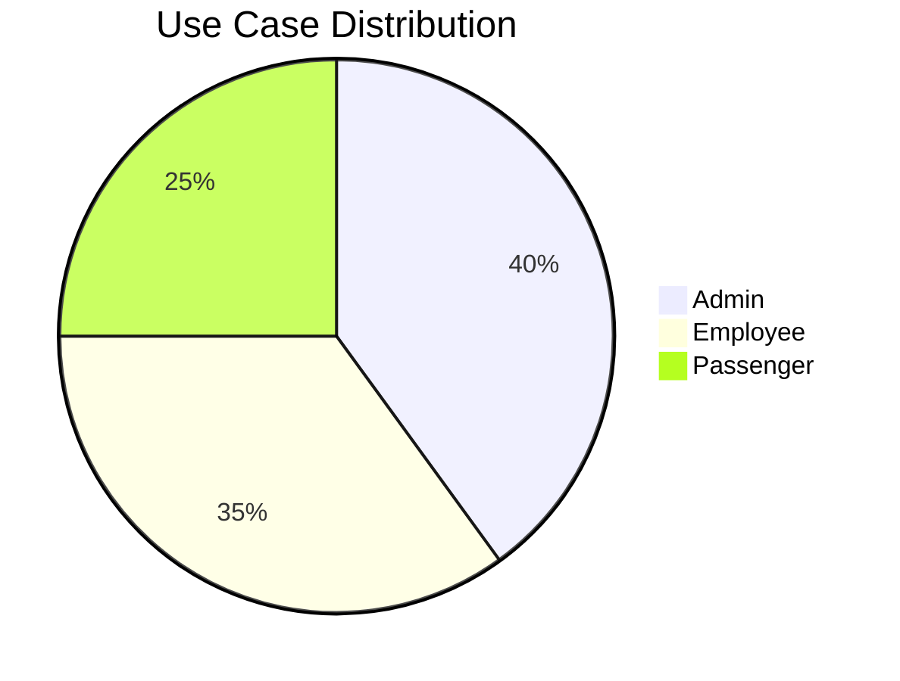
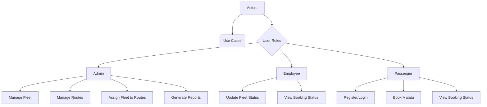

# Sacco Management System - Use Case Diagram

```mermaid
erDiagram
    %% Actors
    ADMIN ||--o{ MANAGE_FLEET : "manages"
    ADMIN ||--o{ MANAGE_ROUTES : "manages"
    ADMIN ||--o{ ASSIGN_FLEET_TO_ROUTES : "assigns"
    ADMIN ||--o{ GENERATE_REPORTS : "generates"
    
    EMPLOYEE ||--o{ UPDATE_FLEET_STATUS : "updates"
    EMPLOYEE ||--o{ VIEW_BOOKING_STATUS : "views"
    
    PASSENGER ||--o{ REGISTER_LOGIN : "performs"
    PASSENGER ||--o{ BOOK_MATATU : "books"
    PASSENGER ||--o{ VIEW_BOOKING_STATUS : "views"
    
    %% Use Cases
    REGISTER_LOGIN {
        string register
        string login
    }
    
    BOOK_MATATU {
        string select_route
        string check_availability
        string make_booking
    }
    
    VIEW_BOOKING_STATUS {
        string view_personal_bookings
        string view_all_bookings
    }
    
    MANAGE_FLEET {
        string add_vehicle
        string update_vehicle
        string remove_vehicle
    }
    
    MANAGE_ROUTES {
        string create_route
        string edit_route
    }
    
    ASSIGN_FLEET_TO_ROUTES {
        string link_vehicle_to_route
        string schedule_assignments
    }
    
    UPDATE_FLEET_STATUS {
        string update_availability
        string update_condition
    }
    
    GENERATE_REPORTS {
        string system_usage_report
        string booking_trends_report
        string fleet_performance_report
    }
```







```mermaid
pie
    title System Functionality by Role
    "Fleet Management" : 20
    "Route Management" : 15
    "Booking System" : 25
    "Status Updates" : 15
    "Reporting" : 15
    "User Management" : 10