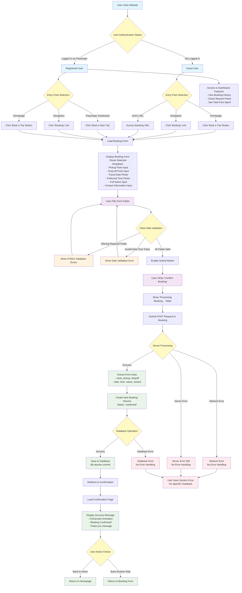

# NaiSmart SACCO Booking Process - User Journey Flow Chart

## Comprehensive User Journey Flow Chart

## Key User Journey Insights

### **Entry Points Analysis**
1. **Multiple Access Routes**: Users can access booking from homepage, navigation, dashboard, or direct URL
2. **Consistent Experience**: Same booking form regardless of entry point
3. **Authentication Awareness**: System recognizes user status but doesn't significantly alter the booking flow

### **User Experience Flow**
1. **Simple Linear Process**: Straightforward form → submit → confirmation flow
2. **Minimal Friction**: No registration required for booking
3. **Immediate Confirmation**: Bookings are instantly confirmed without approval workflow

### **Current Limitations**
1. **No Error Recovery**: Limited error handling and user feedback
2. **No Booking Management**: Users cannot modify or cancel bookings
3. **Basic Validation**: Only client-side HTML5 validation
4. **No Conflict Detection**: No checking for scheduling conflicts or capacity limits

### **Registered User Benefits**
1. **Dashboard Integration**: Access to booking history and statistics
2. **Reward Points**: Tracking of loyalty points based on spending
3. **Personalization**: Potential for pre-filled user information

## Recommended Improvements

### **Enhanced Error Handling**
- Add comprehensive server-side validation
- Implement user-friendly error messages
- Add retry mechanisms for network failures

### **Booking Management**
- Allow users to view, modify, and cancel bookings
- Add booking confirmation emails/SMS
- Implement booking status tracking

### **User Experience Enhancements**
- Add loading states and progress indicators
- Implement form auto-save functionality
- Add booking conflict detection and alternative suggestions

### **Security Improvements**
- Add CSRF protection
- Implement rate limiting
- Add input sanitization and validation