# Naismart SACCO Management System - Database Schema

## Overview
This document provides a comprehensive overview of the Naismart SACCO Management System database schema, including all tables, relationships, and data structures.

## Database Tables Analysis

### 1. User Management Tables

#### `user` Table
- **Purpose**: Core user authentication and role management
- **Fields**:
  - `id` (Integer, Primary Key)
  - `username` (String(150), Unique, Not Null)
  - `email` (String(150), Unique)
  - `password_hash` (String(256), Not Null)
  - `role` (String(50), Default: 'passenger') - Values: admin, employee, passenger
  - `full_name` (String(150), Nullable)
  - `status` (String(50), Default: 'active')

#### `sacco_member` Table
- **Purpose**: Track SACCO membership and shareholding information
- **Fields**:
  - `id` (Integer, Primary Key)
  - `full_name` (String(150), Not Null)
  - `id_number` (String(50), Unique, Not Null)
  - `email` (String(150), Unique)
  - `phone` (String(50))
  - `shareholding` (Float)

### 2. Fleet Management Tables

#### `vehicle` Table
- **Purpose**: Vehicle registration and basic information
- **Fields**:
  - `id` (Integer, Primary Key)
  - `plate_number` (String(20), Unique, Not Null)
  - `vehicle_model` (String(100), Not Null)
  - `assigned_route` (String(100), Nullable)
  - `status` (String(50), Default: 'active')
  - `created_at` (DateTime, Default: utcnow)
  - `updated_at` (DateTime, Default: utcnow, OnUpdate: utcnow)

#### `fleet` Table
- **Purpose**: Extended fleet management (appears to be legacy/duplicate)
- **Fields**:
  - `id` (Integer, Primary Key)
  - `plate_number` (String(20), Unique, Not Null)
  - `vehicle_model` (String(100), Not Null)
  - `assigned_route` (String(100))
  - `status` (String(50), Default: 'active')

### 3. Route Management Tables

#### `route` Table
- **Purpose**: Define transportation routes
- **Fields**:
  - `id` (Integer, Primary Key)
  - `route_name` (String(100), Not Null)
  - `origin` (String(100), Not Null)
  - `destination` (String(100), Not Null)
  - `stops` (String(255), Not Null)
  - `status` (String(20), Not Null)

### 4. Assignment Tables

#### `assigned_route` Table
- **Purpose**: Link employees (drivers) to routes
- **Fields**:
  - `id` (Integer, Primary Key)
  - `employee_id` (Integer, Foreign Key → user.id, Not Null)
  - `route_id` (Integer, Foreign Key → route.id, Not Null)
  - `vehicle_id` (Integer, Foreign Key → vehicle.id, Nullable)
  - `date_assigned` (DateTime, Default: utcnow)
  - `start_date` (Date, Default: utcnow.date, Not Null)
  - `end_date` (Date, Nullable)
  - `status` (String(20), Default: 'active') - Values: active, completed, cancelled
  - `shift` (String(20), Nullable) - Values: morning, afternoon, evening
  - `notes` (Text, Nullable)
  - `created_by` (Integer, Foreign Key → user.id, Nullable)
  - `created_at` (DateTime, Default: utcnow)
  - `updated_at` (DateTime, Default: utcnow, OnUpdate: utcnow)

#### `vehicle_route_assignment` Table
- **Purpose**: Direct vehicle-to-route assignments without requiring a driver
- **Fields**:
  - `id` (Integer, Primary Key)
  - `vehicle_id` (Integer, Foreign Key → vehicle.id, Not Null)
  - `route_id` (Integer, Foreign Key → route.id, Not Null)
  - `assigned_date` (DateTime, Default: utcnow)
  - `start_date` (Date, Default: utcnow.date, Not Null)
  - `end_date` (Date, Nullable)
  - `status` (String(20), Default: 'active') - Values: active, completed, cancelled
  - `priority` (String(20), Default: 'normal') - Values: high, normal, low
  - `notes` (Text, Nullable)
  - `assigned_by` (Integer, Foreign Key → user.id, Nullable)
  - `created_at` (DateTime, Default: utcnow)
  - `updated_at` (DateTime, Default: utcnow, OnUpdate: utcnow)

### 5. Booking System Tables

#### `booking` Table
- **Purpose**: Passenger trip bookings
- **Fields**:
  - `id` (Integer, Primary Key)
  - `route` (String(100), Not Null)
  - `pickup` (String(100), Not Null)
  - `dropoff` (String(100), Not Null)
  - `date` (String(50), Not Null) - Note: Using String instead of Date
  - `time` (String(50), Not Null)
  - `name` (String(100), Not Null)
  - `contact` (String(100), Not Null)
  - `status` (String(20), Default: 'pending')

### 6. Financial Management Tables

#### `employee_payment` Table
- **Purpose**: Track payments to employees
- **Fields**:
  - `id` (Integer, Primary Key)
  - `employee_id` (Integer, Foreign Key → user.id)
  - `total_trips` (Integer)
  - `total_fare_collected` (Float)
  - `commission_earned` (Float)
  - `payment_status` (String(20))
  - `payment_date` (Date)

#### `performance` Table
- **Purpose**: Record employee performance metrics
- **Fields**:
  - `id` (Integer, Primary Key)
  - `employee_id` (Integer, Foreign Key → user.id, Not Null)
  - `date` (Date, Not Null)
  - `trips` (Integer, Default: 0)
  - `fare_collected` (Float, Default: 0.0)
  - `commission` (Float, Default: 0.0)
  - `route` (String(100))

### 7. Operations Tables

#### `driver_log` Table
- **Purpose**: Daily driver activity logging
- **Fields**:
  - `id` (Integer, Primary Key)
  - `driver_id` (Integer, Foreign Key → user.id, Not Null)
  - `vehicle_id` (Integer, Foreign Key → vehicle.id, Not Null)
  - `route_id` (Integer, Foreign Key → route.id, Not Null)
  - `log_date` (Date, Default: utcnow.date, Not Null)
  - `starting_mileage` (Float, Not Null)
  - `ending_mileage` (Float, Not Null)
  - `total_distance` (Float, Not Null)
  - `total_earnings` (Float, Not Null)
  - `fuel_cost` (Float, Nullable)
  - `maintenance_cost` (Float, Nullable)
  - `net_earnings` (Float, Not Null)
  - `trips_completed` (Integer, Default: 0, Not Null)
  - `passengers_served` (Integer, Nullable)
  - `notes` (Text, Nullable)
  - `created_at` (DateTime, Default: utcnow)
  - `updated_at` (DateTime, Default: utcnow, OnUpdate: utcnow)

#### `vehicle_health` Table
- **Purpose**: Vehicle condition monitoring and maintenance tracking
- **Fields**:
  - `id` (Integer, Primary Key)
  - `vehicle_id` (Integer, Foreign Key → vehicle.id, Not Null)
  - `driver_id` (Integer, Foreign Key → user.id, Not Null)
  - `check_date` (DateTime, Default: utcnow)
  - `engine_condition` (Integer, Not Null) - Scale: 1-5
  - `brake_condition` (Integer, Not Null) - Scale: 1-5
  - `tire_condition` (Integer, Not Null) - Scale: 1-5
  - `lights_condition` (Integer, Not Null) - Scale: 1-5
  - `body_condition` (Integer, Not Null) - Scale: 1-5
  - `fuel_level` (Integer, Not Null) - Scale: 1-5
  - `oil_level` (Integer, Not Null) - Scale: 1-5
  - `coolant_level` (Integer, Not Null) - Scale: 1-5
  - `issues_noted` (Text)
  - `maintenance_needed` (Boolean, Default: False)

## Entity Relationship Diagram (ERD)

```mermaid
erDiagram
    %% User Management
    USER {
        int id PK
        string username UK
        string email UK
        string password_hash
        string role
        string full_name
        string status
    }
    
    SACCO_MEMBER {
        int id PK
        string full_name
        string id_number UK
        string email UK
        string phone
        float shareholding
    }
    
    %% Fleet Management
    VEHICLE {
        int id PK
        string plate_number UK
        string vehicle_model
        string assigned_route
        string status
        datetime created_at
        datetime updated_at
    }
    
    FLEET {
        int id PK
        string plate_number UK
        string vehicle_model
        string assigned_route
        string status
    }
    
    %% Route Management
    ROUTE {
        int id PK
        string route_name
        string origin
        string destination
        string stops
        string status
    }
    
    %% Assignment Tables
    ASSIGNED_ROUTE {
        int id PK
        int employee_id FK
        int route_id FK
        int vehicle_id FK
        datetime date_assigned
        date start_date
        date end_date
        string status
        string shift
        text notes
        int created_by FK
        datetime created_at
        datetime updated_at
    }
    
    VEHICLE_ROUTE_ASSIGNMENT {
        int id PK
        int vehicle_id FK
        int route_id FK
        datetime assigned_date
        date start_date
        date end_date
        string status
        string priority
        text notes
        int assigned_by FK
        datetime created_at
        datetime updated_at
    }
    
    %% Booking System
    BOOKING {
        int id PK
        string route
        string pickup
        string dropoff
        string date
        string time
        string name
        string contact
        string status
    }
    
    %% Financial Management
    EMPLOYEE_PAYMENT {
        int id PK
        int employee_id FK
        int total_trips
        float total_fare_collected
        float commission_earned
        string payment_status
        date payment_date
    }
    
    PERFORMANCE {
        int id PK
        int employee_id FK
        date date
        int trips
        float fare_collected
        float commission
        string route
    }
    
    %% Operations
    DRIVER_LOG {
        int id PK
        int driver_id FK
        int vehicle_id FK
        int route_id FK
        date log_date
        float starting_mileage
        float ending_mileage
        float total_distance
        float total_earnings
        float fuel_cost
        float maintenance_cost
        float net_earnings
        int trips_completed
        int passengers_served
        text notes
        datetime created_at
        datetime updated_at
    }
    
    VEHICLE_HEALTH {
        int id PK
        int vehicle_id FK
        int driver_id FK
        datetime check_date
        int engine_condition
        int brake_condition
        int tire_condition
        int lights_condition
        int body_condition
        int fuel_level
        int oil_level
        int coolant_level
        text issues_noted
        boolean maintenance_needed
    }
    
    %% Relationships
    USER ||--o{ ASSIGNED_ROUTE : "employee_id"
    USER ||--o{ ASSIGNED_ROUTE : "created_by"
    USER ||--o{ VEHICLE_ROUTE_ASSIGNMENT : "assigned_by"
    USER ||--o{ EMPLOYEE_PAYMENT : "employee_id"
    USER ||--o{ PERFORMANCE : "employee_id"
    USER ||--o{ DRIVER_LOG : "driver_id"
    USER ||--o{ VEHICLE_HEALTH : "driver_id"
    
    ROUTE ||--o{ ASSIGNED_ROUTE : "route_id"
    ROUTE ||--o{ VEHICLE_ROUTE_ASSIGNMENT : "route_id"
    ROUTE ||--o{ DRIVER_LOG : "route_id"
    
    VEHICLE ||--o{ ASSIGNED_ROUTE : "vehicle_id"
    VEHICLE ||--o{ VEHICLE_ROUTE_ASSIGNMENT : "vehicle_id"
    VEHICLE ||--o{ DRIVER_LOG : "vehicle_id"
    VEHICLE ||--o{ VEHICLE_HEALTH : "vehicle_id"
```

## Key Relationships Summary

### Primary Relationships:
1. **User → Assigned Routes**: One user (employee) can have multiple route assignments
2. **User → Performance**: One user can have multiple performance records
3. **User → Employee Payments**: One user can have multiple payment records
4. **User → Driver Logs**: One user (driver) can have multiple daily logs
5. **User → Vehicle Health**: One user (driver) can perform multiple vehicle health checks

6. **Route → Assigned Routes**: One route can be assigned to multiple employees
7. **Route → Vehicle Route Assignments**: One route can have multiple vehicles assigned
8. **Route → Driver Logs**: One route can have multiple driver log entries

9. **Vehicle → Assigned Routes**: One vehicle can be assigned to multiple routes (through employees)
10. **Vehicle → Vehicle Route Assignments**: One vehicle can have multiple direct route assignments
11. **Vehicle → Driver Logs**: One vehicle can have multiple driver log entries
12. **Vehicle → Vehicle Health**: One vehicle can have multiple health check records

## Schema Analysis & Observations

### Strengths:
1. **Comprehensive Coverage**: Covers all major aspects of SACCO transportation management
2. **Flexible Assignment System**: Both employee-route and direct vehicle-route assignments
3. **Detailed Tracking**: Comprehensive logging of performance, payments, and vehicle health
4. **Audit Trail**: Created/updated timestamps on key tables

### Areas for Improvement:
1. **Data Type Inconsistencies**: Booking table uses strings for dates instead of proper Date types
2. **Potential Redundancy**: Both `vehicle` and `fleet` tables exist with similar purposes
3. **Missing Constraints**: Some foreign key relationships could be strengthened
4. **Normalization Opportunities**: Some denormalized data could be better structured
5. **Missing Indexes**: Performance could be improved with strategic indexing

### Recommendations:
1. **Consolidate Vehicle Tables**: Merge `vehicle` and `fleet` tables
2. **Standardize Date Fields**: Convert string dates to proper Date/DateTime types
3. **Add Referential Integrity**: Strengthen foreign key constraints
4. **Create Lookup Tables**: For status values, roles, and other enumerated data
5. **Add Audit Fields**: Consistent created_by, updated_by fields across all tables